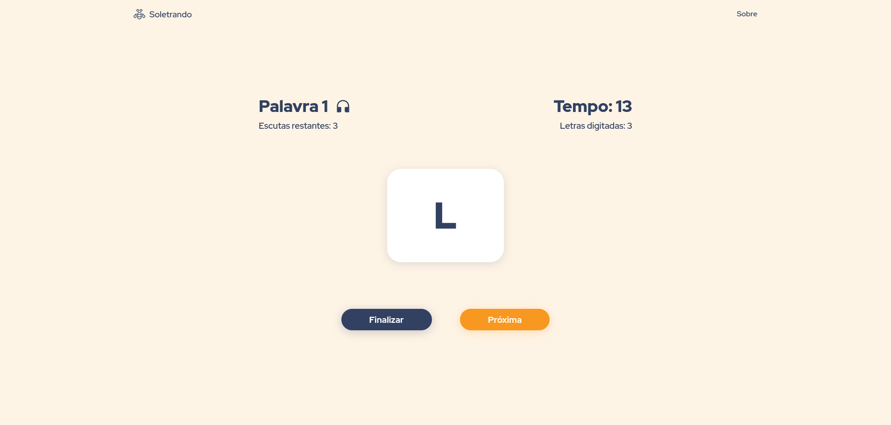

# Soletrando

**Número da Lista**: 2<br>
**Conteúdo da Disciplina**: Programação Dinâmica<br>

## Alunos
|Matrícula | Aluno |
| -- | -- |
| 18/0113666 |	Ítalo Álves Guimarães |
| 18/0114689	| Tiago Samuel Rodrigues |

## Sobre 
Jogo de soletrar palavras. Utiliza o algoritmo "Edit Distance" para calcular a nota do participante.

## Screenshots



## Instalação 
**Linguagem**: Javascript<br>
**Framework**: ReactJS<br>

## Requisitos
yarn ou npm

## Como rodar
1) Rode os seguintes comandos na raiz do projeto
```
npm install
npm start
```
ou
```
yarn
yarn start
